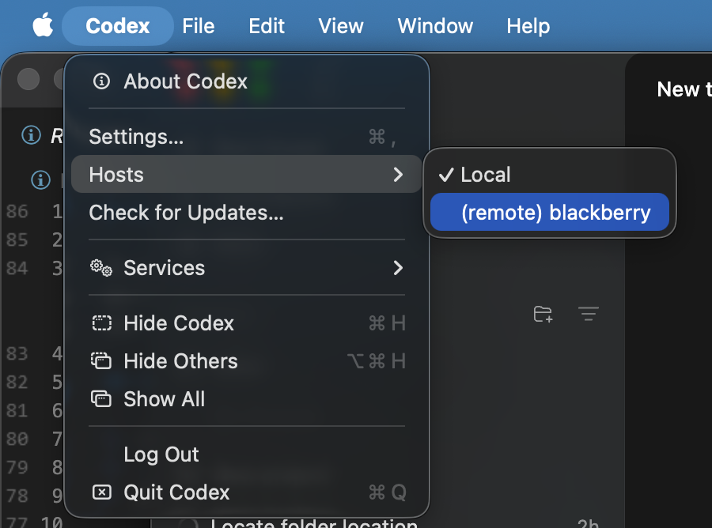

# Codex App remote development

Use the macOS Codex app with your own Linux machine over SSH.

This works whether the host is reachable over Tailscale, your LAN, a VPN, or any other network path.




## Usage

```bash
./codex-remote.sh --ssh-host <user>@<host> --apply
```

This:

- checks SSH access
- makes sure plain SSH can run `codex app-server`
- fixes the remote `PATH` if `codex` is only visible in interactive shells
- writes `~/.codex/remote-ssh-v0.toml`

## Open It In Codex

1. **Restart** Codex.
2. In the Apple menu (see picture) Open `Codex > Hosts > (remote) ...`.
3. A separate remote window will open.
4. Tada!

## If You Cannot SSH To The Remote Computer Yet

Install [Tailscale](https://github.com/tailscale/tailscale) on the remote machine, bring it online, and enable Tailscale SSH:

```bash
sudo tailscale up --ssh
```

Then run this repo against the Tailscale hostname:

```bash
./codex-remote.sh --ssh-host <user>@<tailscale-hostname> --apply
```

## License

MIT. See [LICENSE](/Users/talian/Documents/New%20project/LICENSE).
